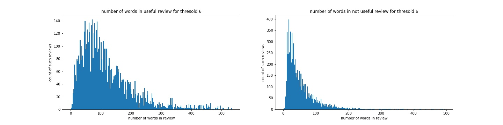
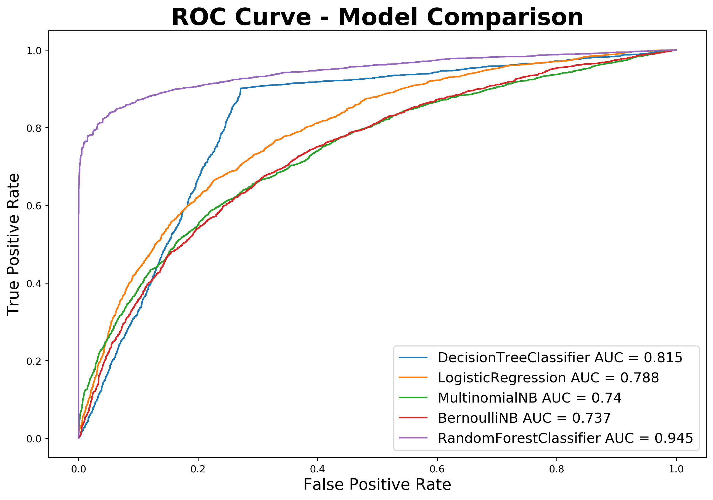
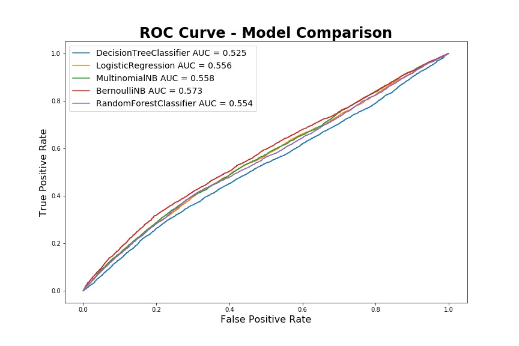

## Yelp review usefullness prediction
​
​
# Overview : 
​
Yelp has become very useful app now a days to serach for almost all utility. This project is about predicting if yelp review will be useful or not. Generally people read only first few review so if we can successfully predict if people will find a review useful, yelp can give it a priority and put in before reviews that are predicted as not useful.
​
​

​
# Dataset - 
​
[Dataset is available here :](https://www.yelp.com/dataset/challenge)
This dataset contains 6668738 reiews from 179974 different businesses. So if we consider useful count 0 as not useful review and useful count >=1 as useful review than distribution of useful and not useful review out of 6668738 reviews is as below:
​

​
​
For this project from 1489 indian restaurants in USA, 79767 reviews are extracted from json file using pypark. So if we consider useful count 0 as not useful review and useful count >=1 as useful review than distribution of useful and not useful review out of 79767 reviews is as below:
​
​

​
​
Data are taken from 2 files review.json and business.json, following columns are used for this project:
​
review file columns
​
        Column - Description - Datatype
        
  - business_id - company id - alphanumeric
  - text - comments made by reviwer - Text statements
  - useful - if comment was helpful or not, liked by reviwers - number
  - funny - if comment was funny or not, liked as funny by reviwers - number
  - cool - if comment was cool or not, liked as cool comment by reviwers - number
  
business file columns
​
        Column - Description - Datatype
        
  - business_id - company id - alphanumeric
  - name - Name of company - String
  - categories - Type of business - String
​
# EDA
​
# Data Cleaning
- Filling missing values in pros and cons
- Convert pros and cons from object data type to string
    
# Feature selection
##### Performed following steps to select most frequent words from pros and cons:
- Normalized text 
- Remove special charcters using Regular Expression
- Tokenization
- Remove stop words
- create vector using tf-idf
​
# Number of words and number of reviews distribution
​

​
​
# Modle selection and ROC curve
​
Using over and under sampling
​

​
Using 2-gram 
​

​
​
​
​
​
​
​
​
​
​
​
​
   
​
​
​
